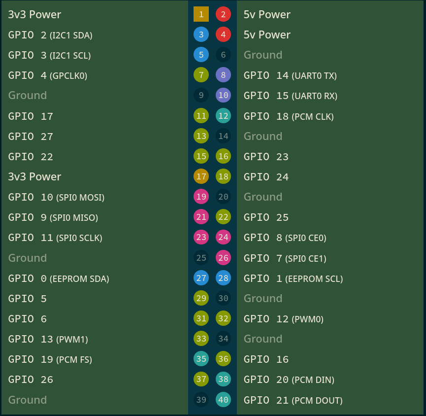

# RPi Server


<!-- WARNING: THIS FILE WAS AUTOGENERATED! DO NOT EDIT! -->

``` python
import RPi.GPIO as GPIO
GPIO.setmode(GPIO.BCM) # numbers from 0 to 40
```

pinout of a RPI


``` python
pins_a = [7, 11, 13, 15, 19, 21, 23, 27] # high to low
pins_a.reverse()
```

``` python
pins_a
```

    [27, 23, 21, 19, 15, 13, 11, 7]

``` python
GPIO.setup(pins_a, GPIO.OUT)
```

``` python
GPIO.output(pins_a, GPIO.HIGH)
```
